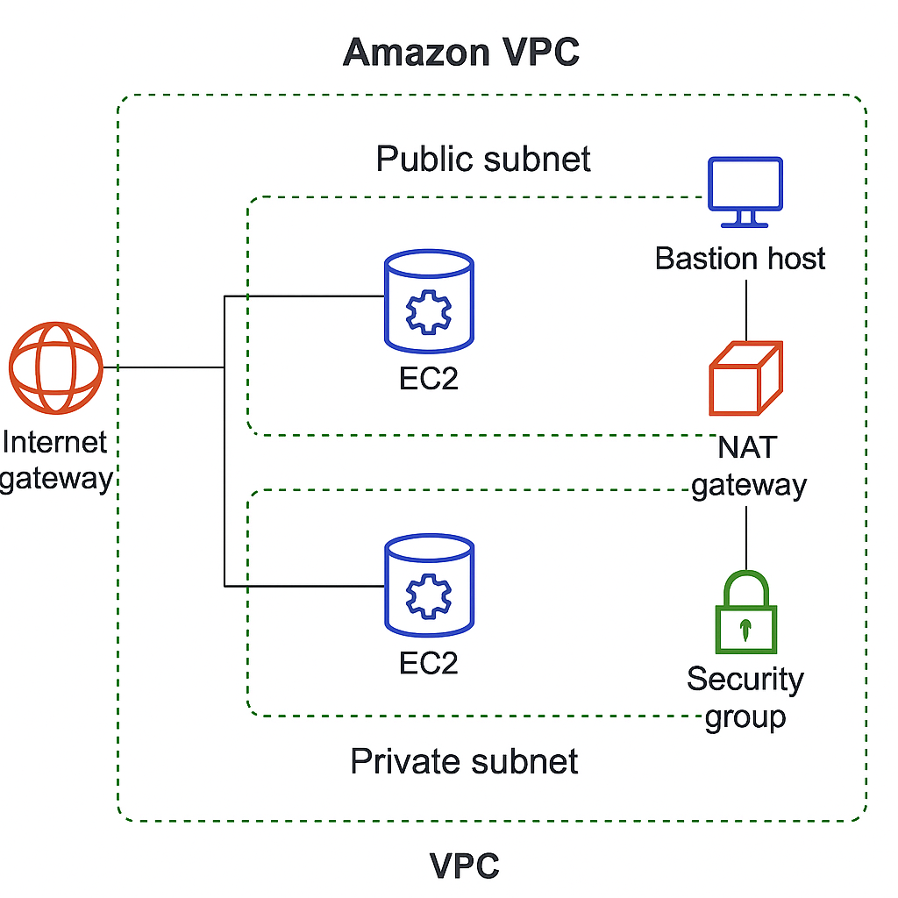

# VPC with Public and Private Subnets

This project sets up a custom VPC with:
- 2 public subnets
- 2 private subnets
- NAT Gateway for private subnet internet access
- Security Groups and NACLs

## ✅ AWS Services Used
- Amazon VPC
- Subnets
- Internet Gateway
- NAT Gateway
- Route Tables
- Security Groups
- NACLs
- EC2 (for Bastion Host)

## 📐 Architecture Diagram


## 🚀 Setup Instructions

### Step 1: Create VPC and Subnets
1. Create a custom VPC (e.g., 10.0.0.0/16)
2. Create 2 public subnets in different AZs (e.g., 10.0.1.0/24, 10.0.2.0/24)
3. Create 2 private subnets in different AZs (e.g., 10.0.3.0/24, 10.0.4.0/24)

### Step 2: Attach Internet Gateway and Configure Route Tables
1. Create and attach an Internet Gateway (IGW) to the VPC
2. Create a route table for public subnets and associate them
3. Add a route to 0.0.0.0/0 pointing to the IGW

### Step 3: Configure NAT Gateway for Private Subnets
1. Create an Elastic IP
2. Launch a NAT Gateway in a public subnet using the Elastic IP
3. Create a route table for private subnets and add route to 0.0.0.0/0 pointing to the NAT Gateway

### Step 4: Security Groups and NACLs
1. Create security groups to allow SSH/HTTP as needed
2. Optionally configure NACLs for additional subnet-level security

---

## 💡 Bonus: Add a Bastion Host

### Why a Bastion Host?
A Bastion Host allows secure SSH access to EC2 instances in private subnets via a jump box located in a public subnet.

### Instructions:
1. Launch an EC2 instance (Amazon Linux) in a public subnet
2. Allow SSH access (port 22) in its security group **from your IP**
3. Ensure the instance has a public IP and key pair attached
4. SSH into Bastion Host:
   ```bash
   ssh -i your-key.pem ec2-user@<bastion-public-ip>
   ```
5. From the Bastion, SSH into a private instance:
   ```bash
   ssh -i your-key.pem ec2-user@<private-instance-ip>
   ```

---

## 📘 Notes
- Use multiple AZs for high availability
- Ensure proper IAM and least privilege access
- Diagram placeholder: Save your `architecture-diagram.png` in the repo

